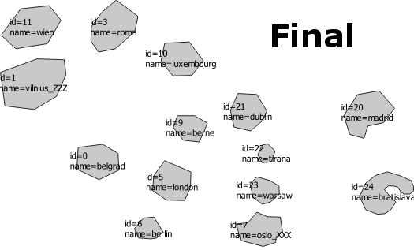
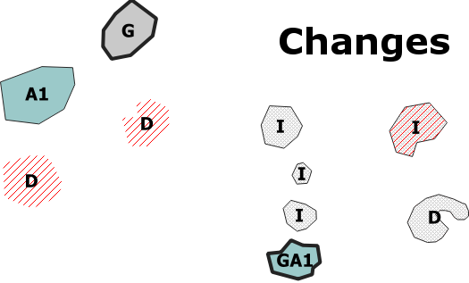

# Difference detection

NB: To setup a coding environment, see [here](https://github.com/eurostat/README/blob/master/docs/howto/java_eclipse_maven_git_quick_guide.md) and [there](https://github.com/eurostat/JGiscoTools#setup).

To analyse the differences between two versions of a dataset, use:

```java
DifferenceDetection geoDiff = new DifferenceDetection(features1, features2);
```

where `features1` and `features2` are the two datasets to compare, in two different versions. This input data can be loaded, for example, from a [GeoPackage](https://www.geopackage.org/) source with:

```java
Collection<Feature> features1 = GeoData.getFeatures("C:/myDatasetVersion2015.gpkg", "id");
Collection<Feature> features2 = GeoData.getFeatures("C:/myDatasetVersion2020.gpkg", "id");
```

where *id* is the dataset column where the dataset identifier is defined. This identifier is expected to be stable between the two versions (corresponding features in both versions should have the same identifier). Both dataset versions are assumed to have the exact same structure (attribute names and types, geometry type).

## Get differences

To retrieve the differences between the two versions, use:

```java
Collection<Feature> differences = geoDiff.getDifferences();
```

This produces a GeoDiff dataset containing the differences between both versions. See the [GeoDiff format description](https://github.com/eurostat/GeoDiff/tree/master/geodiff_format).

See below an example of differences on a test dataset:

<kbd></kbd>

<kbd></kbd>

<kbd></kbd>

Identical features can also be retrieved with:

```java
Collection<Feature> identicals = geoDiff.getIdentical();
```

## Apply incremental changes

The differences returned by the ``geoDiff.getDifferences()`` method capture the entire information needed to transform the dataset from an initial version to a final one. The final version can thus be obtained by applying the changes to the initial version with:

```java
DifferenceDetection.applyChanges(features1, geoDiff.getDifferences());
```

The equality of the result with the final version can then be checked with ``DifferenceDetection.equals(features2, features1);`` which returns ``true``.

## Analyse differences

### Geometrical differences

For an overview of the geometrical differences use: 

```java
Collection<Feature> hfgeoms = geoDiff.getHausdorffGeomDifferences();
```

This produces a set of linear features representing the [Hausdorf segments](https://en.wikipedia.org/wiki/Hausdorff_distance) between the two versions of the geometries. This segment represents the place where the geometrical difference between the two versions is maximum. Its length is a good measure for the difference magnitude.

<kbd></kbd>

(First version in gray - Second version blue outline - Corresponding Hausdorf segment in purple)

For a more detailled overview of the geometrical differences, use:

```java
Collection<Feature> geomch = geoDiff.getGeomDifferences();
```
This produces a set of features representing the spatial gains and losses between the two versions of the geometries. Gains are labeled with an attribute *GeoDiff* set to *I*, and losses are labeled with *D* value.

<kbd></kbd>

(Geometry gains in green, losses in red)

### Identifier stability issues

The stability of the identifier between two versions of a feature might not be respected, by mistake. This leads to the detection of superfluous pairs (deletion, insertion) of the same feature, which do not reflect genuine difference of the dataset. In general, a pair (deletion, insertion) is not considered as pertinent when both feature versions are the same (or have very similar geometries), but their identifier is different. To detect such issues, use:

```java
Collection<Feature> sus = DifferenceDetection.findIdStabilityIssues(differences, 500);
```

This extracts the difference features representing these superflous (deletion, insertion) pairs. Those pairs could be either removed if both feature versions are exactly the same, or replaced with a difference if these versions are similar. The parameter *500* indicates the distance threshold to decide when the geometries are too similar to be considered as representing totally different entities.

<kbd></kbd>

(Detected stability issues in pink)

## Documentation

See the [Javadoc API](https://eurostat.github.io/JGiscoTools/src/site/apidocs/eu/europa/ec/eurostat/jgiscotools/geodiff/DifferenceDetection.html).

## Use it as program

See [GeoDiff](https://github.com/eurostat/GeoDiff).
